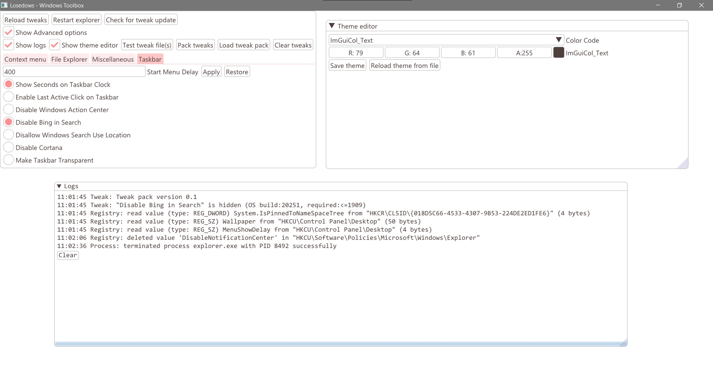

# Losedows
Losedows is a tool made for tweaking **Windows 10** by modifying the Windows registry.

**This project uses [Dear ImGui](https://github.com/ocornut/imgui) library.**

### Installation

---

Download from [GitHub Release](releases), extract it then open `Losedows.exe`. No installation required.

### Features

---

- Simple and user-friendly user interface
- Support all Windows 10 versions and builds
- Update / reload tweaks without restarting the app
- bundled tweaks
- Make custom tweaks (see [here](docs/make_tweaks.md))
- Theme Editor (if you don't like the original one)
- Show logs inside the app
- Simulate mode (simulate tweaks without modifying the registry)
- ~~Localization~~ (Working on it)

### User Interface

---



### Development

---

##### **Note:  Please use Developer Command Prompt for Visual Studio**

##### Clone the repository

```sh
git clone --recurse-submodules https://github.com/yusing/Losedows
cd Losedows
```

##### Build Dear ImGui

```sh
build_imgui.bat
```

##### Build Losedows (In command prompt or Visual Studio)

Configurations: Debug|Release_D3D9|Release_D3D10|Release_D3D11|SimulateMode

Platforms: "x86"|"x64"

```sh
msbuild -p:Configuration=$(Configuration);Platform=$(Platform)
```

The binaries will be found in `Losedows\$(Configuration)\$(Platform)`

 ### License

---

Copyright 2020 yusing

Licensed under the [Apache License](http://www.apache.org/licenses/LICENSE-2.0)
