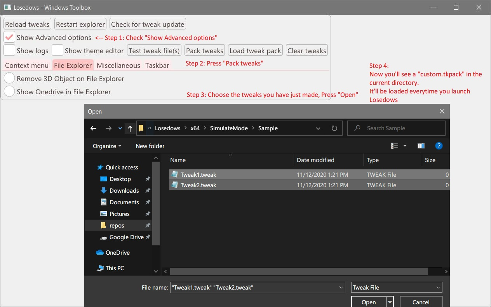

# Making custom tweaks

### Introduction

---

Tweaks are in **2** formats

- `.tkpack` (Tweaks pack)
- `.tweak` (Tweak file)

You need to create `.tweak` files and [pack them into a `.tkpack` file](#Packing tweaks).

As seen in [UI showcase](UI.jpg), tweaks are grouped by categories into different tabs.

Therefore, you may need to make multiple`.tweak` files for different categories of tweaks.

### Syntax

---

A `.tweak` file begins with a *category name* like "Context Menu", 

then follow up with one or more tweak(s) with the syntax below (Except for [DeleteKey](#DeleteKey)):  **[ ] means its optional**

```
#Tweak_Title1
Registry_Key
Tweak_Type Registry_Value[=Optimal_Value] [Default=Default_Value]

[#Tweak_Title2
Registry_Key
Tweak_Type Registry_Value[=Optimal_Value] [Default=Default_Value]]
```

A tweak can have multiple sub-tweaks as well, for example:

```
#Disable Bing in Search
HKCU\SOFTWARE\Microsoft\Windows\CurrentVersion\Search
CreateValue BingSearchEnabled=false
CreateValue CortanaConsent=false
```

*Note that the root key (e.g. `HKEY_LOCAL_MACHINE` and `HKEY_CLASS_ROOT`) has to be in short form (e.g. `HKEY_LOCAL_MACHINE` => `HKLM` and `HKEY_CLASS_ROOT` => `HKCR`)*


### Tweak Types

---

There are **7** types of tweak:

- [Bool](#Bool)
- [Dword](#Dword)
- [String](#String)
- [CreateValue](#CreateValue)
- [DeleteValue](#DeleteValue)
- [CreateSubKey](#CreateSubKey)
- [DeleteKey](#DeleteKey)

#### Bool

 `Bool` is a *registry value* that has `REG_DWORD` type with value *0* or *1* .

Value: *None*  **(only `Registry_Value` is required)**

- If it has either *optimal value* or *default value*
  - It will not be shown (An error will be shown in *Logs* window)
- Otherwise
  - It will be shown as a *radio button* (Press to [toggle](#Toggle Types)).
  - The *radio button* is *inactive* if the value is *0* , *active* if value is *1*. 

##### Example

```
#Show Onedrive in File Explorer
HKCR\CLSID\{018D5C66-4533-4307-9B53-224DE2ED1FE6}
Bool System.IsPinnedToNameSpaceTree
```

#### Dword

`Dword` is a registry value that has`REG_DWORD` type.

Value: *hexadecimal integer* **(Either`Optimal_Value` or `Default_value`, not both)**

- If it has an *optimal value*
  - It will be shown as a `Apply` *button*
- If it has a *default value*
  - It will be shown as a number input box with `Apply` and `Restore` buttons
- If it has both
  - It will not be shown (An error will be shown in *Logs* window)

#### String

 `String` type is a registry value that has  `REG_SZ` type.

Value: *String surrounded with double quotes* **(Either`Optimal_Value` or `Default_value`, not both)**

​			*use \\" to make escaped double-quotes*

- If it has an *optimal value*
  - It will be shown as a `Apply` *button*
- If it has a *default value*
  - It will be shown as a text box with `Apply` and `Restore` buttons
- If it has both
  - It will not be shown (An error will be shown in *Logs* window)

##### Example

```
#Wallpaper
HKCU\Control Panel\Desktop
String Wallpaper Default="c:\windows\web\wallpaper\windows\img0.jpg"

#Disable Auto Disk Checking on Boot
HKLM\SYSTEM\CurrentControlSet\Control\Session Manager
String BootExecute="autocheck autochk /k:C*"
```

#### CreateValue

 `CreateValue` is a tweak that *needs to create a registry value to apply*

Value: *String, hexadecimal integer or Boolean value*  **(only `Optimal_Value` is required)**

- If it has Optimal_Value only
  - It will be shown as a *radio button* (Press to [toggle](#Toggle Types)).
  - The *radio button* is **active** if the value **exists**, **inactive** if it **does not exist**. 
- Otherwise
  - It will not be shown (An error will be shown in *Logs* window)

##### Example

```
#Disable Windows Update
HKLM\SOFTWARE\Policies\Microsoft\Windows\WindowsUpdate\AU
CreateValue NoAutoUpdate=false
```

#### DeleteValue

`DeleteValue` is a tweak that needs to *delete* a registry value to apply

Value: *String, hexadecimal integer or Boolean value*  **(only `Default_Value` is required)**

- If it has Default_Value only
  - It will be shown as a *radio button* (Press to [toggle](#Toggle Types)).
  - The *radio button* is **inactive** if the value **exists**, **active** if it **does not exist**. 
- Otherwise
  - It will not be shown (An error will be shown in *Logs* window)

#### CreateSubKey

 `CreateSubKey` is used to create sub-keys and delete them when not needed

Value: *None* **(Only `Registry_value` is required, no need to surround it with double-quotes)**

- If it has either *optimal value* or *default value*
  - It will not be shown (An error will be shown in *Logs* window)
- Otherwise
  - It will be shown as a *radio button* (Press to [toggle](#Toggle Types)).
  - The *radio button* is **active** if the sub-key **exists**, **inactive** if it **does not exist**. 

##### Example

```
#Add "Open with Powershell" to context menu
HKCR\Directory\shell\
CreateSubKey Open with Powershell
CreateValue Icon="C:\Windows\system32\WindowsPowerShell\v1.0\powershell.exe"
CreateSubKey command
CreateValue ="C:\Windows\system32\WindowsPowerShell\v1.0\powershell.exe -NoExit -Command Set-Location -LiteralPath '%L'"
```

#### DeleteKey

`DeleteKey` is used when needed to delete a key to apply the tweak

Syntax: a minus sign `-` followed by a registry key

Value: *None* **(No Registry_Value, Optimal_Value or Default_Value)**

- If it has registry value, *optimal value* or *default value*
  - It will not be shown (An error will be shown in *Logs* window)
- Otherwise
  - It will be shown as a *radio button* (Press to [toggle](#Toggle Types)).
  - The *radio button* is **inactive** if the key **exists**, **active** if it **does not exist**. 

##### Example

```
#Remove 3D Object on File Explorer
-HKLM\SOFTWARE\Microsoft\Windows\CurrentVersion\Explorer\MyComputer\NameSpace\{0DB7E03F-FC29-4DC6-9020-FF41B59E513A}
-HKLM\SOFTWARE\WOW6432Node\Microsoft\Windows\CurrentVersion\Explorer\MyComputer\NameSpace\{0DB7E03F-FC29-4DC6-9020-FF41B59E513A}
```

### Toggle Types

---

Note that the status (*active* or *inactive*) of the *radio button* is **overridden by the main tweak**

For example of this tweak,

```
#Some tweak
HKLM\SomeKey
Bool BooleanValueA
Bool BooleanValueB
```

If `BooleanValueA` is *0* but `BooleanValueB` is *1*, the *radio button* is still *inactive*.

When the toggled, `BooleanValueA` will be set to *1* and `BooleanValueB` remains unchanged.

### Packing tweaks

---



